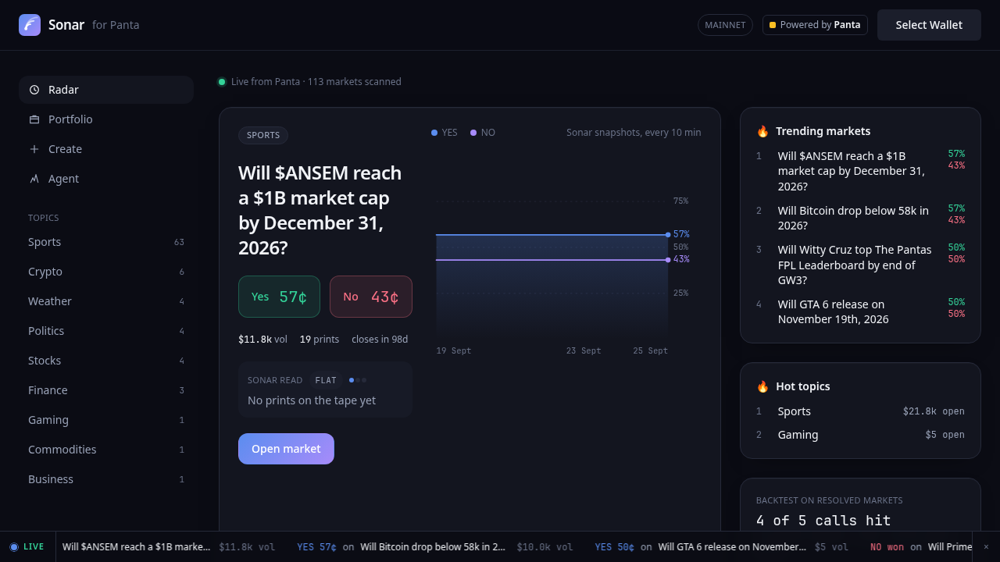
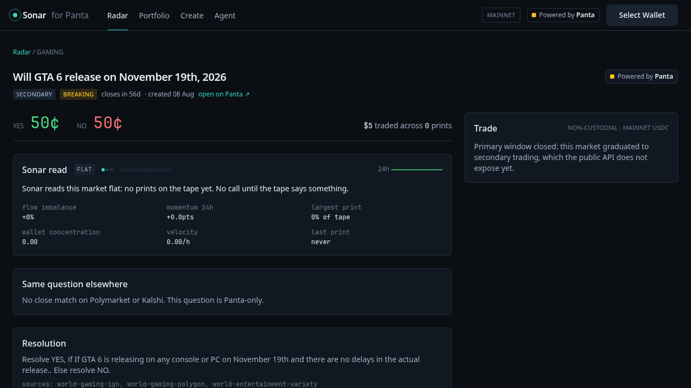
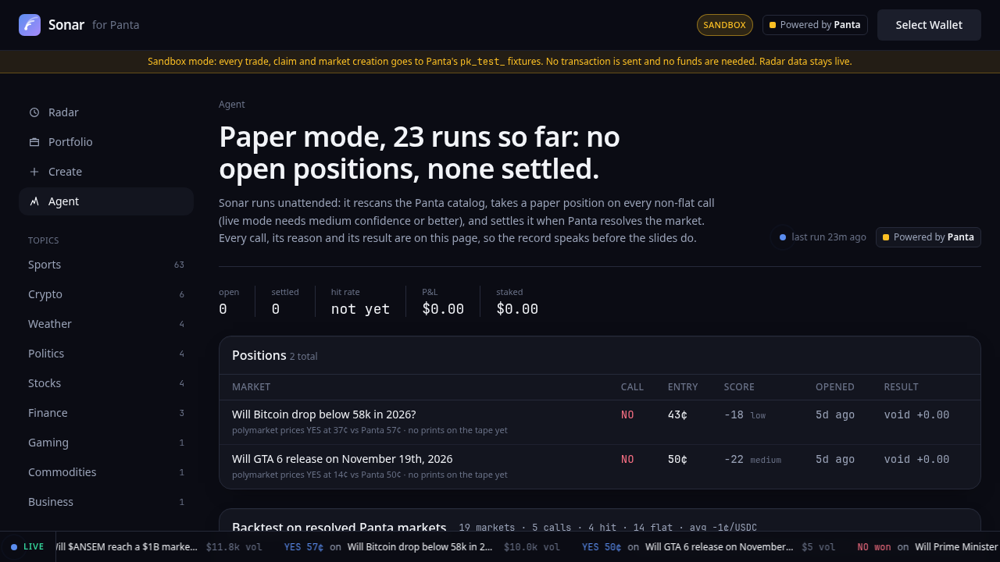

# Sonar for Panta

**The intelligence layer for on-chain prediction markets.** Behavioural signals, cross-venue pricing and one-click non-custodial trading for [Panta](https://panta.market) markets on Solana. _Powered by Panta._

Built for Colosseum's **Crypto World's Fair 2026** (Solana ecosystem track), the **Superteam Nigeria** track and the **Panta API** side track. MIT licensed.



Sonar already runs live on Kalshi and Polymarket ([sonar.nodalytics.xyz](https://sonar.nodalytics.xyz): 672 resolved signals, 57.7% 30-day win rate). This repository brings the same engine to Panta's on-chain markets through the Panta API and adds what Panta itself does not expose: price history, tape analytics, a price check against the two largest off-chain venues, an autonomous agent with a public record, and a creator flow seeded with Nigerian markets.

## What it does

| Surface | Panta API calls | What you get |
| --- | --- | --- |
| **Radar** (`/`) | `GET /markets/` × status × category, `GET /markets/{id}/`, `GET /markets/{id}/trades/` | Every market Panta exposes, scored from its own tape (flow imbalance, 24h momentum, whale prints, wallet concentration, velocity, staleness) plus the same question's price on Polymarket / Kalshi. A persistent registry keeps live markets on the radar even when Panta's rotating list pages drop them. |
| **Market** (`/market/{id}`) | detail + tape, `POST /primaryorderquote/`, `/primaryorderbuild/`, `/primaryordersubmit/`, `/primaryorderverify/`, `POST /trades/` | The Sonar read with reasons, a sparkline from our own snapshots, cross-venue gap, resolution rule, full tape with Solscan links, and a quote → sign → broadcast → report buy panel. |
| **Portfolio** (`/portfolio`) | `GET /positions/`, `GET /markets/{id}/`, `POST /claim/build/`, `POST /trades/` (kind claim) | Positions marked to live prices, one-click claims, attribution reported back. |
| **Create** (`/create`) | `POST /markets/create/quote/`, `/build/`, `/register/` | Headline / URL → Claude drafts a resolvable YES/NO market → edit → quote fee → sign → register. Starter boards for Nigeria (CBN, NBS inflation, naira, NGX, Super Eagles, fuel) and global questions. |
| **Agent** (`/agent`) | everything above, unattended | Paper (or live, with a server keypair) positions on every call, settled on resolution, plus a backtest over resolved Panta markets. |
| **Pitch** (`/pitch`) | | Ten-slide deck that reads its traction numbers from the live store. Arrow keys to navigate, prints to PDF. |

Every write is non-custodial: Panta builds instructions, the user's wallet signs, we broadcast on our RPC and file the signature back to Panta for attribution. The API key never reaches the browser.

<p>


</p>

## Zero-cost demo (sandbox mode)

The header has a **Mainnet / Sandbox** switch (or open any page with `?sandbox=1`). In sandbox mode every write (buy quote, build, submit, verify, claim, market creation, attribution) goes to Panta's `pk_test_` fixtures: the whole flow runs, Panta returns order ids and signatures, and nothing is sent to Solana. A connected wallet with zero balance is enough. The radar, market pages and agent keep using live data. This is how the demo video was recorded; no funds were spent anywhere in this project.

## Run it

```bash
cp .env.example .env.local   # add PANTA_API_KEY (pk_live_ for real data, pk_test_ for the sandbox)
npm install
npm run snapshot             # one radar refresh (≈90 s: 2 API calls per market, rate-limited)
npm run agent                # one agent tick (refresh + open/settle paper positions + backtest)
npm run dev                  # http://localhost:3000
```

`PANTA_TEST_API_KEY` (a `pk_test_` key) enables sandbox mode. Optional env: `KV_REST_API_URL`/`KV_REST_API_TOKEN` (Upstash, for persistence on Vercel), `ANTHROPIC_API_KEY` (Claude drafting; falls back to a template), `CRON_SECRET` (protects `/api/refresh` and `/api/agent`), `SONAR_AGENT_MODE=live` + `SONAR_AGENT_KEYPAIR` (JSON secret key) to execute real primary buys, `SONAR_STORE_FILE` for a JSON file store when running scripts locally.

Production: see [docs/DEPLOY.md](docs/DEPLOY.md). The radar refresh and agent tick run every 10 minutes from [`.github/workflows/sonar-tick.yml`](.github/workflows/sonar-tick.yml) into Upstash; Vercel only serves.

## Architecture

```
                 ┌──────────────── every 10 min (GitHub Actions / Vercel cron) ────────────────┐
                 │  list × status × category → detail → tape → venue match → snapshot → signals │
                 └───────────────────────────────┬──────────────────────────────────────────────┘
   Panta API  ◄── src/lib/panta.ts (typed, rate-limited, server-only) ──►   src/lib/radar.ts ──► store (Upstash / file)
   Polymarket Gamma, Kalshi ◄── src/lib/venues.ts (token Dice similarity + number match)         │
                                                                                                  ▼
   Browser ◄── Next.js app router pages ◄── /api/* routes (proxy Panta with the server key) ◄── read models
   wallet-adapter signs; @solana/web3.js broadcasts; signature reported back to Panta (/trades)
```

- `src/lib/signals.ts` is pure: detail row + tape + snapshots + venue match → `SignalSet`. No I/O, trivially testable.
- `src/lib/agent.ts` runs the loop: refresh, settle resolved positions, open new ones, optional live execution.
- `src/lib/backtest.ts` replays the first 60% of each resolved tape through the same function and compares with the outcome.
- `src/lib/store.ts` picks Upstash, a JSON file, or memory at runtime.

## How the signal is built

For each market Sonar pulls the last 200 prints and computes, on the last 24h (or last 20 prints when thin):

- **flow imbalance**: YES share flow minus NO share flow, over total;
- **momentum**: YES price now vs our oldest snapshot inside 24h (Panta has no history endpoint, so Sonar records its own every 10 min);
- **whale share** and **wallet concentration** (HHI): how much of the tape is one print / one wallet;
- **velocity** and **staleness**: prints per hour, seconds since the last print;
- **cross-venue gap**: Polymarket/Kalshi YES price for the best-matching question minus Panta's.

Composite score in −100..100 = 0.45·gap + 0.25·flow + 0.2·momentum + 0.1·whale (weights shift to flow when no venue match), then discounted for thin, stale or single-wallet tape and zeroed after close. |score| < 12 is FLAT; ≥ 45 with ≥ 5 prints is high confidence.

The **backtest** replays the first 60% of each resolved market's tape through the same function and compares the call with Panta's outcome. Panta's catalog is young, so the sample is small and reported as-is. The **agent** has paper-traded every call since 19 September 2026 and settles against Panta's own resolutions.

## Documents

- [docs/BUSINESS-PLAN.md](docs/BUSINESS-PLAN.md): problem, product, model, go-to-market, market size, competition, risks, ask.
- [docs/PANTA-API-FEEDBACK.md](docs/PANTA-API-FEEDBACK.md): fifteen issues and gaps found during the build, with reproductions.
- [docs/DEMO_SCRIPT.md](docs/DEMO_SCRIPT.md): pitch and technical demo video scripts.
- [docs/SUBMISSION.md](docs/SUBMISSION.md): answers for the Colosseum, Superteam Nigeria and Panta forms.
- [docs/DEPLOY.md](docs/DEPLOY.md): Vercel + Upstash + GitHub Actions.

## Stack

Next.js 14 (app router) · TypeScript · Tailwind · `@solana/wallet-adapter` · `@solana/web3.js` · Upstash Redis (optional) · Anthropic SDK (optional) · GitHub Actions scheduler.

## Disclosure

The signal design comes from Sonar, the author's existing prediction-market product on Kalshi/Polymarket (closed source, off-chain, unfunded). Everything in this repository was written for the hackathon window, from scratch, against the Panta API. No funding has been raised for either.

## Author

Great Ojietohamen, GreYat Labs, Lagos ([@G-ojies](https://github.com/G-ojies)).
