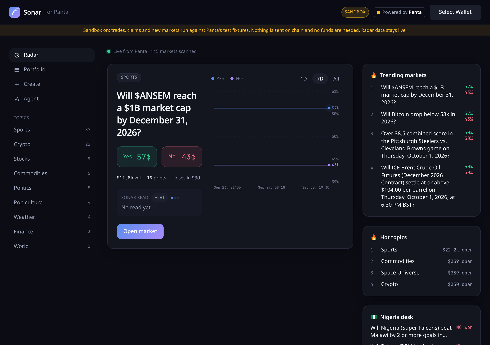
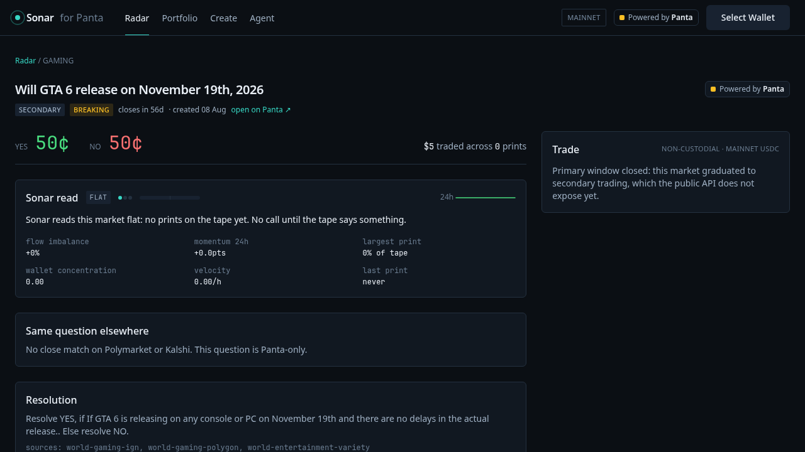
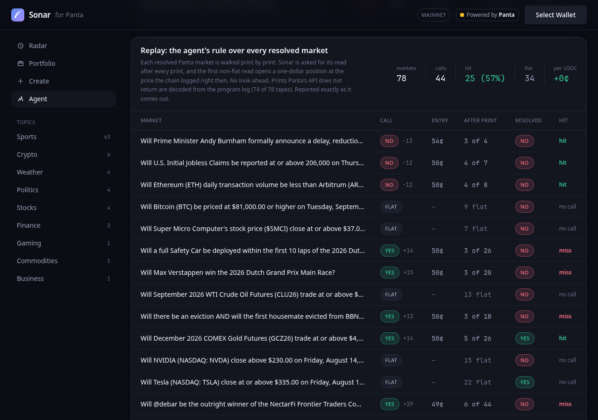
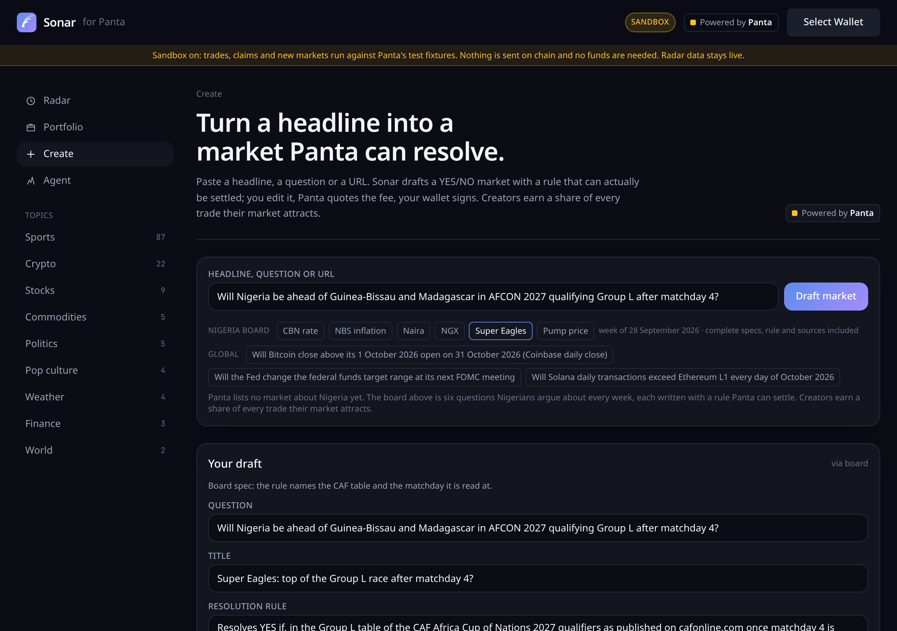
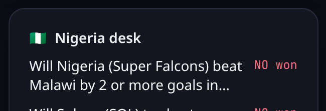

# Sonar for Panta

**The intelligence layer for on-chain prediction markets.** Behavioural signals, cross-venue pricing and one-click non-custodial trading for [Panta](https://panta.market) markets on Solana. _Powered by Panta._

Built for Colosseum's **Crypto World's Fair 2026** (Solana ecosystem track), the **Superteam Nigeria** track, the **Panta API** side track, the **Solami** side track and the **RPC Fast** infrastructure side track. MIT licensed.



Sonar already runs live on Kalshi and Polymarket ([sonar.nodalytics.xyz](https://sonar.nodalytics.xyz): 672 resolved signals, 57.7% 30-day win rate). This repository brings the same engine to Panta's on-chain markets through the Panta API and adds what Panta itself does not expose: price history, tape analytics, a price check against the two largest off-chain venues, an autonomous agent with a public record, and a creator flow seeded with Nigerian markets.

## What it does

| Surface | Panta API calls | What you get |
| --- | --- | --- |
| **Radar** (`/`) | `GET /markets/` × status × category, `GET /markets/{id}/`, `GET /markets/{id}/trades/` | Every market Panta exposes, scored from its own tape (flow imbalance, 24h momentum, whale prints, wallet concentration, velocity, staleness) plus the same question's price on Polymarket / Kalshi. A persistent registry keeps live markets on the radar even when Panta's rotating list pages drop them. |
| **Market** (`/market/{id}`) | detail + tape, `POST /primaryorderquote/`, `/primaryorderbuild/`, `/primaryordersubmit/`, `/primaryorderverify/`, `POST /trades/` | The Sonar read with reasons, a sparkline from our own snapshots, cross-venue gap, resolution rule, full tape with Solscan links, and a quote → sign → broadcast → report buy panel. |
| **Portfolio** (`/portfolio`) | `GET /positions/`, `GET /markets/{id}/`, `POST /claim/build/`, `POST /trades/` (kind claim) | Positions marked to live prices, one-click claims, attribution reported back. |
| **Create** (`/create`) | `POST /markets/create/quote/`, `/build/`, `/register/` | Headline / URL → Claude drafts a resolvable YES/NO market → edit → quote fee → sign → register. Starter boards for Nigeria (CBN, NBS inflation, naira, NGX, Super Eagles, fuel) and global questions. |
| **Agent** (`/agent`) | everything above, unattended | Paper (or live, with a server keypair) positions on every call, settled on resolution, plus a backtest over resolved Panta markets. |
| **Pitch** (`/pitch`) | | Ten-slide deck that reads its traction numbers from the live store. Arrow keys to navigate, prints to PDF. |

Every write is non-custodial: Panta builds instructions, the user's wallet signs, we broadcast on our RPC and file the signature back to Panta for attribution. The API key never reaches the browser.

<p>


</p>
<p>


</p>

The **Nigeria board** is six questions Nigerians argue about every week, each written as a complete Panta market (rule, sources, dates) in `src/lib/boards.ts`; one click loads it on Create, and all six have been through Panta's sandbox create flow. See [docs/NIGERIA-BOARD.md](docs/NIGERIA-BOARD.md).

## Zero-cost demo (sandbox mode)

The header has a **Mainnet / Sandbox** switch (or open any page with `?sandbox=1`). In sandbox mode every write (buy quote, build, submit, verify, claim, market creation, attribution) goes to Panta's `pk_test_` fixtures: the whole flow runs, Panta returns order ids and signatures, and nothing is sent to Solana. A connected wallet with zero balance is enough. The radar, market pages and agent keep using live data. This is how the demo video was recorded; no funds were spent anywhere in this project.

## Run it

```bash
cp .env.example .env.local   # add PANTA_API_KEY (pk_live_ for real data, pk_test_ for the sandbox)
npm install
npm run snapshot             # one radar refresh (≈90 s: 2 API calls per market, rate-limited)
npm run agent                # one agent tick (refresh + open/settle paper positions + backtest)
npm run dev                  # http://localhost:3000
```

`PANTA_TEST_API_KEY` (a `pk_test_` key) enables sandbox mode. Optional env: `RPCFAST_API_KEY` or `SOLAMI_API_KEY` (the chain data path, see below), `KV_REST_API_URL`/`KV_REST_API_TOKEN` (Upstash, for persistence on Vercel), `ANTHROPIC_API_KEY` (Claude drafting; falls back to a template), `CRON_SECRET` (protects `/api/refresh` and `/api/agent`), `SONAR_AGENT_MODE=live` + `SONAR_AGENT_KEYPAIR` (JSON secret key) to execute real primary buys, `SONAR_STORE_FILE` for a JSON file store when running scripts locally.

Production: https://sonarpanta.xyz, a Render free web service defined in `render.yaml`; see [docs/DEPLOY.md](docs/DEPLOY.md). The radar refresh and agent tick run every 10 minutes: a pinger calls `POST /api/agent`, which does the work in the background and writes to Upstash; [`.github/workflows/sonar-tick.yml`](.github/workflows/sonar-tick.yml) is the fallback (GitHub throttles its cron to every few hours).

## The chain data path: RPC Fast or Solami

Sonar reads Solana through [RPC Fast](https://rpcfast.com) when `RPCFAST_API_KEY` is set, through [Solami](https://solami.dev) when `SOLAMI_API_KEY` is set, and through the public endpoints when neither is. Two things run on that path:

- **RPC** rebuilds each market's tape from the Panta program's log (`getSignaturesForAddress` + `getTransaction`), paced to the plan's request rate.
- **WebSocket** carries the live tape stream: one `logsSubscribe` filtered to the Panta program. A trade is decoded and added to its market's tape seconds after it confirms, instead of on the next scan. The socket reconnects with backoff and closes the gap after a reconnect or restart.

RPC Fast serves both from one host (`solana-rpc.rpcfast.com`, Frankfurt), and every plan including the free Start plan has WebSocket access, so both paths run there. Its nodes keep about a day of ledger, so the reads that go months back (a market's whole tape) are routed to an archive endpoint, Solami or the public one, after a probe; the health line names that path too.
- **Health is surfaced.** `/api/health` reports the provider on each path, the last slot seen, prints streamed and reconnects; every market page shows one status line under the tape.

```bash
echo "RPCFAST_API_KEY=<your key>" >> .env.local     # or SOLAMI_API_KEY
npm run stream                                        # watch the stream from a terminal (add -- --replay 6 to replay recent trades)
curl -s localhost:3000/api/health | jq .chain.paths   # "RPC: RPC Fast, stream: RPC Fast"
```

A key the provider refuses (revoked, out of balance, wrong type) moves that path to the public fallback for half an hour, and the health line says so. A key on Solami's Free plan has RPC but no WebSocket, so with Solami the rebuild runs on Solami and the stream falls back to the public endpoint. Details, env vars, plan limits and the fallback rules: [docs/RPCFAST.md](docs/RPCFAST.md) and [docs/SOLAMI.md](docs/SOLAMI.md).

## Architecture

```
                 ┌──────────────── every 10 min (pinger → /api/agent, GitHub Actions fallback) ────────────────┐
                 │  list × status × category → detail → tape → venue match → snapshot → signals │
                 └───────────────────────────────┬──────────────────────────────────────────────┘
   Panta API  ◄── src/lib/panta.ts (typed, rate-limited, server-only) ──►   src/lib/radar.ts ──► store (Upstash / file)
   Polymarket Gamma, Kalshi ◄── src/lib/venues.ts (token Dice similarity + number match)         │
                                                                                                  ▼
   Browser ◄── Next.js app router pages ◄── /api/* routes (proxy Panta with the server key) ◄── read models
   wallet-adapter signs; @solana/web3.js broadcasts; signature reported back to Panta (/trades)
```

- `src/lib/signals.ts` is pure: detail row + tape + snapshots + venue match → `SignalSet`. No I/O, trivially testable.
- `src/lib/agent.ts` runs the loop: refresh, settle resolved positions, open new ones, optional live execution.
- `src/lib/chain-tape.ts` rebuilds a market's tape from the program log on chain (`getSignaturesForAddress` + `getTransaction`, no IDL) wherever Panta's trades endpoint returns fewer prints than the chain counts.
- `src/lib/tape-stream.ts` holds one WebSocket subscription to the program's log and appends each print to its market's stored tape as it confirms; `src/lib/chain-endpoints.ts` picks the RPC and WebSocket endpoints (RPC Fast or Solami with a key, public without) and paces calls to the plan's rate.
- `src/lib/backtest.ts` replays the agent's rule print by print over every resolved market (walk-forward, no look-ahead) and settles each call against the outcome.
- `src/lib/store.ts` picks Upstash, a JSON file, or memory at runtime.

## How the signal is built

For each market Sonar pulls the last 200 prints and computes, on the last 24h (or last 20 prints when thin):

- **flow imbalance**: YES share flow minus NO share flow, over total;
- **momentum**: YES price now vs our oldest snapshot inside 24h (Panta has no history endpoint, so Sonar records its own every 10 min);
- **whale share** and **wallet concentration** (HHI): how much of the tape is one print / one wallet;
- **velocity** and **staleness**: prints per hour, seconds since the last print;
- **cross-venue gap**: Polymarket/Kalshi YES price for the best-matching question minus Panta's.

Composite score in −100..100 = 0.45·gap + 0.25·flow + 0.2·momentum + 0.1·whale (weights shift to flow when no venue match), then discounted for thin, stale or single-wallet tape and zeroed after close. |score| < 12 is FLAT; ≥ 45 with ≥ 5 prints is high confidence.

The **replay** walks every resolved market print by print, asks Sonar for its read after each print, opens a one-dollar position on the first non-flat read at the YES price the chain logged at that moment, and settles it against Panta's outcome. Panta's trades endpoint returns no prints for most resolved markets and every graduated one, so the tape is decoded from the program's own log on chain. Panta's catalog is young, so the sample is small and reported as-is. The **agent** has paper-traded every call since 19 September 2026 and settles against Panta's own resolutions.

## Tests

```bash
npm test
```

76 tests, no network and no API key needed. They cover the parts the record depends on: the signal engine (a YES tape and a NO tape mirror each other, a closed market never produces a call), the replay (prints added after the opening print cannot change the call, so there is no look-ahead), the decoder that reads orders from the Solana program log, the live tape stream (endpoint selection for RPC Fast, Solami and no key, a pushed log line becoming a stored print, refusal and fallback, the ledger-history probe and routing, reconnect backoff and the catch-up after a gap), the cross-venue matcher (including the false match that was fixed), and the Nigeria board specs. CI runs typecheck, lint and tests on every push.

## Documents

- [docs/COMPETITIVE-LANDSCAPE.md](docs/COMPETITIVE-LANDSCAPE.md): the other Panta entries, analytics tools on other venues, Nigerian incumbents, with sources.
- [docs/BUSINESS-PLAN.md](docs/BUSINESS-PLAN.md): problem, product, model, go-to-market, market size, competition, risks, ask.
- [docs/PANTA-API-FEEDBACK.md](docs/PANTA-API-FEEDBACK.md): seventeen issues and gaps found during the build, with reproductions.
- [docs/DEMO_SCRIPT.md](docs/DEMO_SCRIPT.md): pitch and technical demo video scripts.
- [docs/SUBMISSION.md](docs/SUBMISSION.md): answers for the Colosseum, Superteam Nigeria and Panta forms.
- [docs/DEPLOY.md](docs/DEPLOY.md): Vercel + Upstash + GitHub Actions.
- [docs/RPCFAST.md](docs/RPCFAST.md): RPC Fast as the chain data path, env vars, plan limits and compute-unit use, running it with your own key.
- [docs/SOLAMI.md](docs/SOLAMI.md): the same for Solami, plus stream health field by field.

## Stack

Next.js 14 (app router) · TypeScript · Tailwind · `@solana/wallet-adapter` · `@solana/web3.js` · RPC Fast or Solami RPC and WebSocket (optional) · Upstash Redis (optional) · Anthropic SDK (optional) · GitHub Actions scheduler.

## Disclosure

The signal design comes from Sonar, the author's existing prediction-market product on Kalshi/Polymarket (closed source, off-chain, unfunded). Everything in this repository was written for the hackathon window, from scratch, against the Panta API. No funding has been raised for either.

## Author

Great Ojietohamen, GreYat Labs, Benin City ([@G-ojies](https://github.com/G-ojies)).
